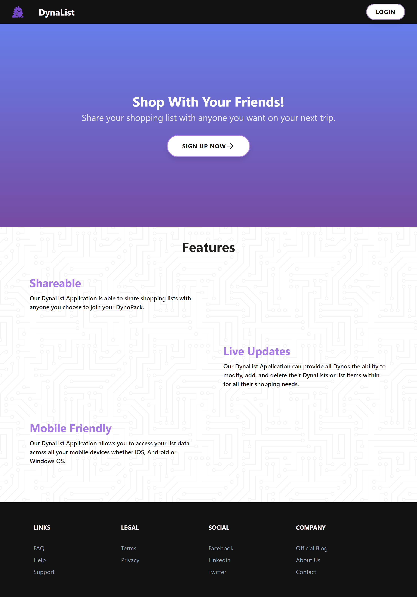
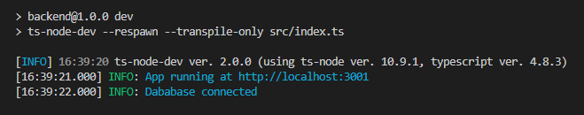
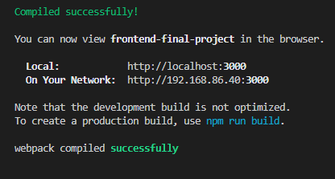

# DynaList
Created by [Alissa Makligh](https://www.linkedin.com/in/alissa-makligh-820196127/), [Caroline Konrad](https://www.linkedin.com/in/caroline-konrad-b01576191/), [Enrique Angulo](https://www.linkedin.com/in/enrique-angulo/), and [Jack Wright](https://www.linkedin.com/in/jack-steven-wright/).

DynaList is an app designed to easily share lists with your family and friends. Create groups, add members, create lists, and add items that you can see from anywhere.

[Visit DynaList](https://dynalist-frontend.herokuapp.com/)

<!--  -->

## Technologies Used

DynaList is a Node.js app built using React, Express, and MongoDB. The backend was developed in TypeScript, and the frontend was styled with Tailwind.

Full dependencies:

<details>
<summary>Frontend</summary>
 
 - axios
 - react
 - react-dom
 - react-redux
 - react-router
 - react-router-dom
 - react-scripts
 - redux

</details>

<details>
<summary>Backend</summary>

 - bcrypt
 - cors
 - dayjs
 - dotenv
 - express
 - jsonwebtoken
 - lodash
 - mongoose
 - nanoid
 - pino
 - pino-pretty
 - zod

</details>
<br>

## How To Use

You can visit DynaList online at https://dynalist-frontend.herokuapp.com/, or you can follow these steps to run it locally.

1.	Clone the repo by running this command in your terminal:

	```
	git clone https://github.com/DynaList/dynalist.git
	```
	This will create a new local repository on your computer.

2. Move into the backend folder and run `npm install` to install the backend dependencies.
	
3. Inside the backend folder, create a .env file with these contents:
	```
	PORT=3001
	MONGO_URI=mongodb://localhost:27017/dynalist
	ACCESS_TOKEN_TTL=15m
	REFRESH_TOKEN_TTL=1y
	```
	
4. Run the following command to start the backend server:
	```
	npm run dev
	```
	If successful, you should see something like the following:

	
		
5. In a new terminal, move into the frontend folder and run `npm install` to install the frontend dependencies.

6. Inside the frontend folder, create a .env file with these contents:
	```
	REACT_APP_SERVER_URL=http://localhost:3001/
	```

7. Run the following command to start the frontend server:
	```
	npm start
	```
	If successful, you should see something like the following:

	

8. You should now be able to visit http://localhost:3000/ in your browser and see the DynaList home page.

## Future Plans

DynaList is still a work in progress. There are a lot of bugs left to iron out, but there are also some features that we didn't have time to implement in the time we had:

- Add user profile page
- Add notification system (so users can see when they've been added to a group)
- Deploy to AWS
- Better error messages for the user
- Add a chat/comment function within groups to aid with communication